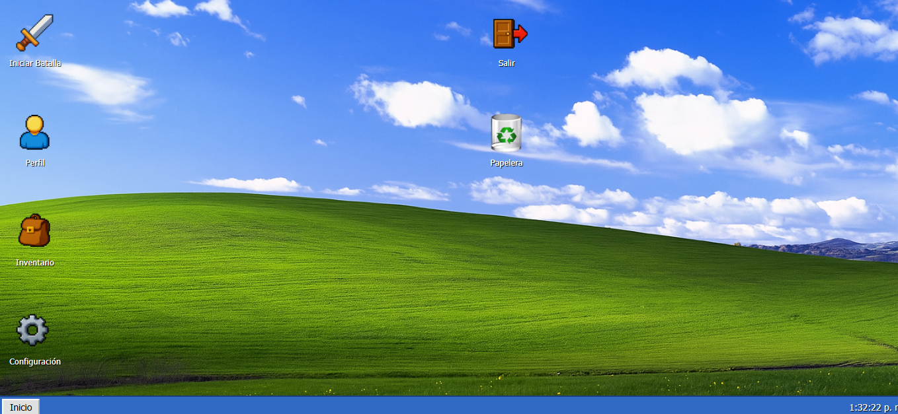

# 🕯️ Shadows in the Void

**"Shadows in the Void"** is a first-person psychological horror game set in the sinister, abandoned research facility of **Blackwood Corp**. Your mission is simple: *survive... and escape*.

Created by **3CB Soluciones and Inyoxz.studios** as part of an independent project with strong narrative and technical focus.

---

## 🎮 Features

- Free exploration with FPS-style controls
- Management of health, sanity, and flashlight battery
- Reactive AI-based monster system with psychological horror mechanics
- Interactive puzzles and key items to progress
- Immersive atmosphere with dynamic messages and paranormal sound effects

---

## 🧪 Story

> You've awakened alone in the Blackwood facility. The lights flicker. The hallways shift. Something is with you.  
> Find the key, disable the security system, and escape before the darkness consumes you...

---

## 🕹️ Controls

| Key / Action | Function |
|--------------|----------|
| `WASD`       | Move     |
| `Mouse`      | Look around |
| `Click`      | Toggle flashlight |
| `E`          | Interact with objects |
| `R`          | Run      |
| `ESC`        | Pause (coming soon) |

---

##  Imágenes del juego

### [][][][][][][][][][][][][][][][][][][][][][][][][][][][][][]

### [][][][][][][][][][][][][][][][][][][][][][][][][][][][][][][][]

### [][][][][][][][][][][][][][][][][][][][][][][][][][][][][][][][]

### [][][][][][][][][][][][][][][][][][][][][][][][][][][][][][][][]

### [][][][][][][][][][][][][][][][][][][][][][][][][][][][][][][][]

